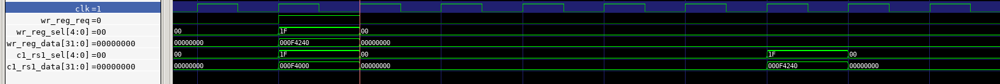

# core full pic

# state

## state C0

read next instruction from memory, and next_state is C1.

## state C1

wait for instruction read out from memory, and execute `instr_c1` combinational logic.
for some instructions, they can be finished in one clock, so next_state goes to C0.
for some instructions, they cannot be finished in one clock, so next_state goes to C2.
the instructions read in C0 is stored in c2_instr_next register and will be used in state C2

### instr_c1()
all instructions are processed in this state.
some processes are enclosed in tasks and they are not very easy to grasp, so there are some notes about them.

the 9 tasks below are called here.

`task op_imm(input [2:0] _funct, input [4:0] _rd, input [4:0] _rs1, input [data_width - 1:0] _i_imm);`
for I type instructions

`task op_branch(input [2:0] _funct, input [4:0] _rs1, input [4:0] _rs2, input [addr_width - 1:0] _offset);`
for B type instructions

`task op_fp(`
for float point type instructions

`task op_op(input [9:0] _funct, input [4:0] _rd_sel, input [4:0] _rs1_sel, input [4:0] _rs2_sel);`
for R type instructions

`task op_lui(input [31:0] _instr, input [4:0] _rd);`
for lui instruction

`task op_auipc(input [31:0] _instr, input [4:0] _rd);`
for auipc instruction

`task op_jal(input [31:0] _instr, input [4:0] _rd_sel);`
for jal instruction

`task op_jalr(input [31:0] _instr, input [4:0] _rd_sel, input [data_width - 1:0] _rs1_data);`
for jalr instruction

`task op_store(input [addr_width - 1:0] _addr);`
for store instruction

## state C2

execute `instr_c2` combinational logic.
some instructions are finished with one clock in this state, then next_state goes to C0.
some other instructions need more than one clock in this state to finish, so next_state goes to C0 after several clocks in C2 state.

### instr_c2

"LOAD, STORE，float point instructions, MUL, DIVU, REMU" instructions are in `instr_c2`.
LOAD and STORE involves memory read or write, so there are state C2.
float point instructions and integer "MUL, DIVU, REMU" instructions are pipelined, so there are state C2

`task op_fp_c2(`
a wrap for float point instructions.

# special operations

## integer

|      |                           |                     |   |
|------|---------------------------|---------------------|---|
| ADD  | chunked_add_task module   | combinational logic |   |
| SUB  | chunked_sub_task module   | combinational logic |   |
| MUL  | mul_pipeline_32bit module | sequential logic    |   |
| DIVU | int_div_regfile module    | sequential logic    |   |
| REMU | same as DIVU              | same as DIVU        |   |
|      |                           |                     |   |

## float

|      |                    |                  |   |
|------|--------------------|------------------|---|
| FADD | float_add_pipeline | sequential logic |   |
| FMUL | float_mul_pipeline | sequential logic |   |

# memory timing 

# register timing

# operation timing

## float add

## float mul
